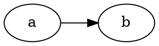

## *welcome to <u>markdown</u> file ~~brewer~~*

> the following files written by markdown format,and those will be show up on website by html format.

---

* **header**

1. # header

2. ## header

3. ### header

4. #### header

5. ##### header

6. ###### header

---

* **math format**:
  $$ y(x,t) = y = A \sin(kx - \omega t) $$

---

* **code format**:

```c
#include <stdio.h>

int main(){
    printf("ljxzdnb!!!");
}
```

---

* **colorfull line**:

  <font color='red'>this is test line!</font><br><font color='blue'>this is test line!!</font>

---

捐助地址：
* **images**:


---

* **tables**:

| A1   | B1   | C1   |
| ---- | ---- | ---- |
| A2   | B2   | C2   |
| A3   | B3   | C3   |
| A4   | B4   | C4   |

---

* **hyperlink**:

[baidu](www.baidu.com)


<br>

* **graphviz**:


  
  
  
  
