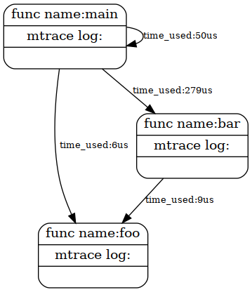

## Code Visualizer

a code visualizer tool write by me,the basic principle is the gcc compilation option.

```c
void main_constructor( void )
        __attribute__ ((no_instrument_function, constructor));

void main_destructor( void )
        __attribute__ ((no_instrument_function, destructor));

void __cyg_profile_func_enter( void *, void * )
        __attribute__ ((no_instrument_function));

void __cyg_profile_func_exit( void *, void * )
        __attribute__ ((no_instrument_function));
```

these four functions will be called before and after executing the function, as long as the processing logic is written,code detection can be realized.

```c
#include <execinfo.h>
```

the header file contains a function that can print the function call stack,function pointer and names can be obtained by string matching

```c
void main_constructor( void )
{
    pid = getpid();
    fp = fopen("graph.dot", "w+");
    if (fp == NULL) exit(-1);
    //setenv("MALLOC_TRACE","graph.dot",1);
    fprintf(fp, "digraph %s {\n\n", "backtrace" );
    //fprintf(fp, "rankdir=LR;\n" );
    fprintf(fp, "node [shape=box, style=rounded ]\n" );
    ptrace(PTRACE_ATTACH,pid,NULL,NULL);

}
```

open a file to write a scripts in .dot language before entering the main function

```c
void __cyg_profile_func_enter(void* func_address, void* call_site)
{
        mtrace();
        ptrace(PTRACE_GETREGSET,pid,NULL,NULL);
        //void* arg = (void*)ptrace(PTRACE_PEEKTEXT,getpid(),regs.pc,NULL);
        long int arg = ptrace(PTRACE_PEEKDATA,pid,(void*)regs.sp,NULL);
        if((void*)arg!=NULL)printf("arg %ld\n",arg);
        start = clock();

}
```

log enter time and memory status of each function

```c
void __cyg_profile_func_exit( void *func_address, void *call_site )
{
        end = clock();
        cpu_time_used = ((double)(end - start)) / CLOCKS_PER_SEC;
        void* trace[128];
        int size = backtrace(trace, 128);
        char** symbols = backtrace_symbols(trace, size);
        char call_name[32];
        char called_name[32];
        for (int i = 0; i < size; i++) {
        char func_name[32];
        void * func_addr;
        unsigned int func_off;
        sscanf(symbols[i],"%*[^[][%p[^]]%*[^\n]",&func_addr);
        sscanf(symbols[i],"%*[^(](%[^+]+%x%*[^)]%*[^\n]",func_name,&func_off);
        func_name[strlen(func_name)] = 0;
        if (func_address+func_off == func_addr){
            memcpy(called_name,func_name,32);
        }
        else if(func_addr == call_site){
            memcpy(call_name,func_name,32);
        }
        //printf("get stash: %d %s\n",i,symbols[i]);
        }
        fprintf( fp, "  %s [shape = record,label=\"{func name:%s|mtrace log:|",called_name,called_name);
        fprintf( fp, "  }\"]\n");
        fprintf( fp, "  %s -> %s ",call_name,called_name);
        free(symbols);
        muntrace();
        fprintf( fp, " [label=\"time_used:%dus\" fontsize=\"10\"]\n",(int)(1000000*cpu_time_used));
}
```

log exit time and memory status of each function

code under test:

main.c

```c
#include <stdio.h>
#include <stdlib.h>

void bar(int arg)
{
    printf("Inside bar()%d\n",arg);
    foo();
}

int main()
{
    char* name = malloc(20);
    int num = 8;
    bar(num);
    foo();
    return 0;
}

```

other.c

```c
#include <stdio.h>
void foo()
{
    printf("Inside foo()\n");
}

```

make.sh

```sh
gcc -g -rdynamic -finstrument-functions -fsanitize=address main.c gcc.c other.c -o main
./main
dot -Tpng graph.dot -o graph.png
```

the effect is as follows:



all codes:

```c
#define _GNU_SOURCE
#include <stdio.h>
#include <stdlib.h>
#include <dlfcn.h>
#include <link.h>
#include <execinfo.h>
#include <stdio.h>
#include <string.h>
#include <time.h>
#include <unistd.h>
#include <mcheck.h>
#include <sys/ptrace.h>
#include <sys/user.h>

void main_constructor( void )
        __attribute__ ((no_instrument_function, constructor));

void main_destructor( void )
        __attribute__ ((no_instrument_function, destructor));

void __cyg_profile_func_enter( void *, void * )
        __attribute__ ((no_instrument_function));

void __cyg_profile_func_exit( void *, void * )
        __attribute__ ((no_instrument_function));

FILE* fp;
pid_t pid;
clock_t start,end;
double cpu_time_used;
struct user_regs_struct regs;

void main_constructor( void )
{
    pid = getpid();
    fp = fopen("graph.dot", "w+");
    if (fp == NULL) exit(-1);
    //setenv("MALLOC_TRACE","graph.dot",1);
    fprintf(fp, "digraph %s {\n\n", "backtrace" );
    //fprintf(fp, "rankdir=LR;\n" );
    fprintf(fp, "node [shape=box, style=rounded ]\n" );
    ptrace(PTRACE_ATTACH,pid,NULL,NULL);
    
}


void main_destructor( void )
{
    ptrace(PTRACE_DETACH,pid,NULL,NULL);
    fprintf( fp, "\n}\n" );
    fclose( fp );
}

void __cyg_profile_func_enter(void* func_address, void* call_site)
{
	mtrace();
	ptrace(PTRACE_GETREGSET,pid,NULL,NULL);
	//void* arg = (void*)ptrace(PTRACE_PEEKTEXT,getpid(),regs.pc,NULL);
	long int arg = ptrace(PTRACE_PEEKDATA,pid,(void*)regs.sp,NULL);
    	if((void*)arg!=NULL)printf("arg %ld\n",arg);
	start = clock();

}
void __cyg_profile_func_exit( void *func_address, void *call_site )
{
	end = clock();
	cpu_time_used = ((double)(end - start)) / CLOCKS_PER_SEC;
	void* trace[128];
    	int size = backtrace(trace, 128);
    	char** symbols = backtrace_symbols(trace, size);
    	char call_name[32];
    	char called_name[32];
    	for (int i = 0; i < size; i++) {
        char func_name[32];
        void * func_addr;
        unsigned int func_off;
        sscanf(symbols[i],"%*[^[][%p[^]]%*[^\n]",&func_addr);
        sscanf(symbols[i],"%*[^(](%[^+]+%x%*[^)]%*[^\n]",func_name,&func_off);
        func_name[strlen(func_name)] = 0;
        if (func_address+func_off == func_addr){
            memcpy(called_name,func_name,32);
        }
        else if(func_addr == call_site){
            memcpy(call_name,func_name,32);
        }
        //printf("get stash: %d %s\n",i,symbols[i]);
    	}
	fprintf( fp, "  %s [shape = record,label=\"{func name:%s|mtrace log:|",called_name,called_name);
	fprintf( fp, "  }\"]\n");
	fprintf( fp, "  %s -> %s ",call_name,called_name);
	free(symbols);
	muntrace();
        fprintf( fp, " [label=\"time_used:%dus\" fontsize=\"10\"]\n",(int)(1000000*cpu_time_used));
}
```

