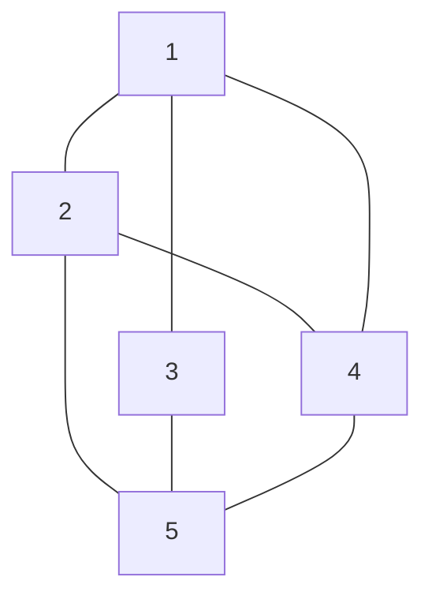

# 图:





图的邻接矩阵表示

|      | v1   | v2   | v3   | v4   | v5   |
| ---- | ---- | ---- | ---- | ---- | ---- |
| v1   | 0    | 1    | 1    | 1    | 0    |
| v2   | 1    | 0    | 0    | 1    | 1    |
| v3   | 1    | 0    | 0    | 0    | 1    |
| v4   | 1    | 1    | 0    | 0    | 1    |
| v5   | 0    | 1    | 1    | 1    | 0    |


# 哈夫曼树

哈夫曼树，第一行输入一个数n，表示叶结点的个数。需要用这些叶结点生成哈夫曼树，根据哈夫曼树的概念，这些结点有权值，即weight，题目需要输出所有结点的值与权值的乘积之和的最小值。

霍夫曼编码是一种无损数据压缩算法。这个想法是为输入字符分配可变长度代码，分配代码的长度基于相应字符的频率。最频繁的字符得到最小的代码，最不频繁的字符得到最大的代码。
分配给输入字符的可变长度代码是[Prefix Codes](http://en.wikipedia.org/wiki/Prefix_code)，意味着代码（位序列）的分配方式使得分配给一个字符的代码不是分配给任何其他字符的代码的前缀。这就是霍夫曼编码如何确保在解码生成的比特流时没有歧义。 
让我们通过一个反例来理解前缀代码。假设有四个字符a、b、c和d，它们对应的变长代码是00、01、0和1。这种编码会导致歧义，因为分配给c的代码是分配给a和b的代码的前缀。如果压缩比特流为0001，则解压缩后的输出可能是“cccd”或“ccb”或“acd”或“ab”。
有关霍夫曼编码的应用， 请参[见此内容。](http://en.wikipedia.org/wiki/Huffman_coding#Applications)
霍夫曼编码主要有两个主要部分

1. 从输入字符构建霍夫曼树。
2. 遍历霍夫曼树并将代码分配给字符。

***构建霍夫曼树的步骤***
输入是一组独特的字符及其出现频率，输出是霍夫曼树。 

1. 为每个唯一字符创建一个叶子节点，并构建所有叶子节点的最小堆（Min Heap用作优先级队列。频率字段的值用于比较最小堆中的两个节点。最初，最不频繁的字符在根）
2. 从最小堆中提取频率最小的两个节点。
   
3. 创建一个新的内部节点，其频率等于两个节点频率之和。将第一个提取的节点作为其左孩子，将另一个提取的节点作为其右孩子。将此节点添加到最小堆。
4. 重复步骤#2 和#3，直到堆中只包含一个节点。剩下的节点是根节点，树是完整的。
   让我们通过一个例子来理解这个算法：

```
character   Frequency
    a            5
    b            9
    c           12
    d           13
    e           16
    f           45
```

**步骤 1.**构建一个包含 6 个节点的最小堆，其中每个节点代表具有单个节点的树的根。
**步骤 2**从最小堆中提取两个最小频率节点。添加一个频率为 5 + 9 = 14 的新内部节点。 


现在最小堆包含 5 个节点，其中 4 个节点是树的根，每个节点有一个元素，一个堆节点是树的根，有 3 个元素

```
character           Frequency
       c               12
       d               13
 Internal Node         14
       e               16
       f               45
```

**步骤 3：**从堆中提取两个最小频率节点。添加频率为 12 + 13 = 25 的新内部节点


现在最小堆包含 4 个节点，其中 2 个节点是树的根，每个节点都有一个元素，两个堆节点是树的根，有多个节点

```
character           Frequency
Internal Node          14
       e               16
Internal Node          25
       f               45
```

**第四步：**提取两个最小频率节点。添加频率为 14 + 16 = 30 的新内部节点


现在最小堆包含 3 个节点。

```
character          Frequency
Internal Node         25
Internal Node         30
      f               45 
```

**步骤 5：**提取两个最小频率节点。添加频率为 25 + 30 = 55 的新内部节点


现在最小堆包含 2 个节点。

```
character     Frequency
       f         45
Internal Node    55
```

**步骤 6：**提取两个最小频率节点。添加频率为 45 + 55 = 100 的新内部节点


现在最小堆只包含一个节点。

```
character      Frequency
Internal Node    100
```

由于堆只包含一个节点，所以算法在这里停止。

```
character   code-word
    f          0
    c          100
    d          101
    a          1100
    b          1101
    e          111
```

输入描述：

输入有多组数据。 每组第一行输入一个数n，接着输入n个叶节点（叶节点权值不超过100，2<=n<=1000）。

```python
# A Huffman Tree Node
class node:
	def __init__(self, freq, symbol, left=None, right=None):
		# frequency of symbol
		self.freq = freq

		# symbol name (character)
		self.symbol = symbol

		# node left of current node
		self.left = left

		# node right of current node
		self.right = right

		# tree direction (0/1)
		self.huff = ''

# utility function to print huffman
# codes for all symbols in the newly
# created Huffman tree


def printNodes(node, val=''):
	# huffman code for current node
	newVal = val + str(node.huff)

	# if node is not an edge node
	# then traverse inside it
	if(node.left):
		printNodes(node.left, newVal)
	if(node.right):
		printNodes(node.right, newVal)

		# if node is edge node then
		# display its huffman code
	if(not node.left and not node.right):
		print(f"{node.symbol} -> {newVal}")


# characters for huffman tree
chars = ['a', 'b', 'c', 'd', 'e', 'f']

# frequency of characters
freq = [ 5, 9, 12, 13, 16, 45]

# list containing unused nodes
nodes = []

# converting characters and frequencies
# into huffman tree nodes
for x in range(len(chars)):
	nodes.append(node(freq[x], chars[x]))

while len(nodes) > 1:
	# sort all the nodes in ascending order
	# based on theri frequency
	nodes = sorted(nodes, key=lambda x: x.freq)

	# pick 2 smallest nodes
	left = nodes[0]
	right = nodes[1]

	# assign directional value to these nodes
	left.huff = 0
	right.huff = 1

	# combine the 2 smallest nodes to create
	# new node as their parent
	newNode = node(left.freq+right.freq, left.symbol+right.symbol, left, right)

	# remove the 2 nodes and add their
	# parent as new node among others
	nodes.remove(left)
	nodes.remove(right)
	nodes.append(newNode)

# Huffman Tree is ready!
printNodes(nodes[0])
```
# [马尔可夫链](https://www.datacamp.com/tutorial/markov-chains-python-tutorial)

马尔可夫链是通常用一组随机变量定义的数学系统，可以根据具体的概率规则进行状态转移。转移的集合满足**马尔可夫性质**，也就是说，转移到任一特定状态的概率只取决于当前状态和所用时间，而与其之前的状态序列无关。马尔可夫链的这个独特性质就是**无记忆性**。

跟随本教程学会使用马尔可夫链，你就会懂得[离散时间马尔可夫链](https://link.juejin.im/?target=https%3A%2F%2Fwww.datacamp.com%2Fcommunity%2Ftutorials%2Fmarkov-chains-python-tutorial%23dtmc)是什么。你还会学习构建（离散时间）[马尔可夫链模型](https://link.juejin.im/?target=https%3A%2F%2Fwww.datacamp.com%2Fcommunity%2Ftutorials%2Fmarkov-chains-python-tutorial%23model)所需的组件及其常见特性。接着学习用 Python 及其 `numpy` 和 `random` 库来实现一个简单的模型。还要学习用多种方式来表示马尔可夫链，比如状态图和[转移矩阵](https://link.juejin.im/?target=https%3A%2F%2Fwww.datacamp.com%2Fcommunity%2Ftutorials%2Fmarkov-chains-python-tutorial%23transitionmatrix)。

想用 Python 处理更多统计问题？了解一下 DataCamp 的 [Python 统计学思维课程](https://link.juejin.im/?target=https%3A%2F%2Fwww.datacamp.com%2Fcourses%2Fstatistical-thinking-in-python-part-1)！

开始吧……

#### 为什么要用马尔可夫链？

马尔可夫链在数学中有广泛使用。同时也在经济学，博弈论，通信原理，遗传学和金融学领域有广泛应用。通常出现在统计学，尤其是贝叶斯统计，和信息论上下文中。在现实中，马尔可夫链为研究机动车辆的巡航定速系统，抵达机场的乘客的排队序列，货币汇率等问题提供了解决思路。最早由 Google 搜索引擎提出的 PageRank 就是基于马尔可夫过程的算法。Reddit 有个叫子版块模拟器的子版块，帖子和评论全部用马尔可夫链自动生成生成，厉害吧！

马尔可夫链是具有马尔可夫性质的随机过程。随机过程或者说具有随机性质是指由一组随机变量定义的数学对象。马尔可夫链要么有离散状态空间（一组随机变量的可能值的集合）要么有离散索引集合（通常表示时间），鉴于此，马尔可夫链有众多变种。而通常所说的「马尔可夫链」是指具有离散时间集合的过程，也就是离散时间马尔可夫链（DTMC）。

#### 离散时间马尔可夫链

离散时间马尔可夫链所包含的系统的每一步都处于某个状态，步骤之间的状态随机变化。这些步骤常被比作时间的各个瞬间（不过你也可以想成物理距离或者随便什么离散度量）。离散时间马尔可夫链是随机变量 X1，X2，X3 … 的序列，不过要满足马尔可夫性质，所以转移到下一概率只和现在的状态有关，与之前的状态无关。用概率数学公式表示如下：

Pr( Xn+1 = x | X1 = x1, X2 = x2, …, Xn = xn) = Pr( Xn+1 = x | Xn = xn)

可见 Xn+1 的概率只和之前的 Xn 的概率有关。所以只需要知道上一个状态就可以确定现在状态的概率分布，满足条件独立（也就是说：只需要知道现在状态就可以确定下一个状态）。

Xi 的可能取值构成的可数集合 S 称为马尔可夫链**状态空间**。状态空间可以是任何东西：字母，数字，篮球比分或者天气情况。虽说时间参数通常是离散的，离散时间马尔可夫链的状态空间却没有什么广泛采用的约束条件，还不如参考任意状态空间下的过程。不过许多马尔可夫链的应用都用到了统计分析更简单的有限或可数无穷状态空间。

#### 模型

马尔可夫链用概率自动机表示（相信我它没有听上去那么复杂！）。系统状态的改变叫做转移。各个状态改变的概率叫做转移概率。概率自动机包括从已知转移到转移方程的概率，将其转换为转移矩阵。

还可以将马尔可夫链看作有向图，其中图 n 的边标注的是 n 时刻状态转移到 n+1 时刻状态的概率，Pr(Xn+1 = x | Xn = xn)。这个式子可以读做，从已知状态 Xn 转移到状态 Xn+1 的概率。这个概念也可以用从时刻 n 到时刻 n+1 的**转移矩阵**来表示。状态空间的每个状态第一次出现是作为转移矩阵的行，第二次是列。矩阵的每个元素都表示从这一行表示的状态转移到列状态的概率。

如果马尔可夫链有 N 种状态，转移矩阵就是 N x N 维，其中（I, J）表示从状态 I 转移到状态 J 的概率。此外，转移矩阵一定是概率矩阵，也就是每一行元素之和一定是 1。为什么？因为每一行表示自身的概率分布。

所以模型的主要特征包括：状态空间，描述了特定转移发生的概率的转移矩阵以及由初始分布给出的状态空间的初始状态。

好像很复杂？

我们来看一个简单的例子帮助理解这些概念：

如果 Cj 难得心情不好，她会跑步，或者大吃特吃冰淇淋（译者注：原文 gooble 应为 gobble），要么打个盹儿来调整。

根据以往数据，如果她睡了一觉调整心情，第二天她有 60% 的可能去跑步，20% 的可能继续待在床上，还有 20% 的可能吃一大份冰淇淋。

如果她跑步散心，第二天她有 60% 的可能接着跑步，30% 的可能吃冰淇淋，只有 10% 的可能会去睡觉。

最后，如果她难过时纵情冰淇淋，第二天只有 10% 的可能性继续吃冰淇淋，有 70% 的可能性跑步，还有 20% 的可能性睡觉。


上面由状态图表示的马尔可夫链有 3 个可能状态：睡觉，跑步和冰淇淋。所以转移矩阵是 3 x 3 矩阵。注意，离开某一状态的箭头的值的和一定是 1，这跟状态矩阵每一行元素之和是 1 一样，都表示概率的分布。转移矩阵中每个元素的含义跟状态图的每个状态类似。


这个例子应该会帮助你理解与马尔可夫链有关的几个不同概念。不过在现实世界中如何应用这一理论呢？

借助这个例子，你应该能够回答这种问题：「从睡觉状态开始，2 天后 Cj 最后选择跑步（跑步状态）的概率是多少？」

我们一起算一下。要从睡觉状态转移到跑步状态，Cj 有如下选择：第一天继续睡觉，第二天跑步（0.2 ⋅ 0.6）；第一天换成跑步，第二天继续跑步（0.6 ⋅ 0.6）；第一天去吃冰淇淋，第二天换成跑步（0.2 ⋅ 0.7）。算下来概率是：((0.2 ⋅ 0.6) + (0.6 ⋅ 0.6) + (0.2 ⋅ 0.7)) = 0.62。所以说，从睡觉状态开始，2天后 Cj 处于跑步状态的概率是 62%。

希望这个例子可以告诉你马尔可夫链网络都可以解决哪些问题。

同时，还可以更好地理解马尔可夫链的几个重要性质：

- 互通性：如果一个马尔可夫链可以从任何状态转移至任何状态，那么它就是不可还原的。换句话说，如果任两个状态之间存在一系列步骤的概率为正，就是不可还原的。
- 周期性：如果马尔可夫链只有在大于 1 的某个整数的倍数时返回某状态，那么马尔可夫链的状态是周期性的。因此，从状态「i」开始，只有经过整数倍个周期「k」才能回到「i」，k 是所有满足条件的整数的最大值。如果 k = 1 状态「i」不是周期性的，如果 k > 1，「i」才是周期性的。
- 瞬态性和常返性：如果从状态「i」开始，有可能无法回到状态「i」，那么状态「i」有瞬态性。否则具有常返性（或者说持续性）。如果某状态可以在有限步内重现，该状态具有常返性，否则没有常返性。
- 遍历性：状态「i」如果满足非周期性和正重现性，它就有遍历性。如果不具有可还原性的马尔可夫链的每个状态都有遍历性，那么这个马尔可夫链也具有遍历性。
- 吸收态：如果无法从状态「i」转移到其他状态，「i」处于吸收态。因此，如果 当 i ≠ j 时，pii = 1 且 pij = 0，状态「i」处于吸收态。如果马尔可夫链的每个状态都可以达到吸收态，称其为具有吸收态的马尔可夫链。

**窍门**：可以看看[这个网站](https://link.juejin.im/?target=http%3A%2F%2Fsetosa.io%2Fev%2Fmarkov-chains%2F)给出的马尔可夫链的可视化解释。

#### 用 Python 实现马尔可夫链

我们用 Python 来实现一下上面这个例子。当然实际使用的库实现的马尔可夫链的效率会高得多，这里还是给出实例代码帮助你入门……

先 import 用到的库。

```python
import numpy as np
import random as rm
```

然后定义状态及其概率，也就是转移矩阵。要记得，因为有三个状态，矩阵是 3 X 3 维的。此外还要定义转移路径，也可以用矩阵表示。

```python
# 状态空间
states = ["Sleep","Icecream","Run"]
 
# 可能的事件序列
transitionName = [["SS","SR","SI"],["RS","RR","RI"],["IS","IR","II"]]
 
# 概率矩阵（转移矩阵）
transitionMatrix = [[0.2,0.6,0.2],[0.1,0.6,0.3],[0.2,0.7,0.1]]
复制代码
```

别忘了，要保证概率之和是 1。另外在写代码时多打印一些错误信息没什么不好的！

```python
if sum(transitionMatrix[0])+sum(transitionMatrix[1])+sum(transitionMatrix[1]) != 3:
    print("Somewhere, something went wrong. Transition matrix, perhaps?")
else: print("All is gonna be okay, you should move on!! ;)")
```

现在就要进入正题了。我们要用 `numpy.random.choice` 从可能的转移集合选出随机样本。代码中大部分参数的含义从参数名就能看出来，不过参数 `p` 可能比较费解。它是可选参数，可以传入样品集的概率分布，这里传入的是转移矩阵。

```python
def activity_forecast(days):
    # 选择初始状态
    activityToday = "Sleep"
    activityList = [activityToday]
    i = 0
    prob = 1
    while i != days:
        if activityToday == "Sleep":
            change = np.random.choice(transitionName[0],replace=True,p=transitionMatrix[0])
            if change == "SS":
                prob = prob * 0.2
                activityList.append("Sleep")
                pass
            elif change == "SR":
                prob = prob * 0.6
                activityToday = "Run"
                activityList.append("Run")
            else:
                prob = prob * 0.2
                activityToday = "Icecream"
                activityList.append("Icecream")
        elif activityToday == "Run":
            change = np.random.choice(transitionName[1],replace=True,p=transitionMatrix[1])
            if change == "RR":
                prob = prob * 0.5
                activityList.append("Run")
                pass
            elif change == "RS":
                prob = prob * 0.2
                activityToday = "Sleep"
                activityList.append("Sleep")
            else:
                prob = prob * 0.3
                activityToday = "Icecream"
                activityList.append("Icecream")
        elif activityToday == "Icecream":
            change = np.random.choice(transitionName[2],replace=True,p=transitionMatrix[2])
            if change == "II":
                prob = prob * 0.1
                activityList.append("Icecream")
                pass
            elif change == "IS":
                prob = prob * 0.2
                activityToday = "Sleep"
                activityList.append("Sleep")
            else:
                prob = prob * 0.7
                activityToday = "Run"
                activityList.append("Run")
        i += 1    
    return activityList
 
# 记录每次的 activityList
list_activity = []
count = 0
 
# `range` 从第一个参数开始数起，一直到第二个参数（不包含）
for iterations in range(1,10000):
        list_activity.append(activity_forecast(2))
 
# 查看记录到的所有 `activityList`    
#print(list_activity)
 
# 遍历列表，得到所有最终状态是跑步的 activityList
for smaller_list in list_activity:
    if(smaller_list[2] == "Run"):
        count += 1
 
# 计算从睡觉状态开始到跑步状态结束的概率
percentage = (count/10000) * 100
print("The probability of starting at state:'Sleep' and ending at state:'Run'= " + str(percentage) + "%")
```

那么问题来了，计算得到的结果为何会趋于 62%？

**注意** 这实际是「大数定律」在发挥作用。大数定律是概率论定律，用来说明在试验次数足够多时，可能性相同的事件发生的频率趋于一致。也就是说，随着试验次数的增加，实际比率会趋于理论或预测的概率。

#### 马尔可夫思维

马尔可夫链教程就到此为止了。本文介绍了马尔可夫链及其性质。简单的马尔可夫链是开始学习 Python 数据科学的必经之路。如果想要更多 Python 统计学资源，请参阅[这个网站](https://link.juejin.im/?target=https%3A%2F%2Fwww.datacamp.com%2Fcommunity%2Ftutorials%2Fpython-statistics-data-science)。


# 树遍历（中序、前序和后序）

与只有一种逻辑遍历它们的线性数据结构（数组、链表、队列、堆栈等）不同，树可以以不同的方式遍历。以下是遍历树的常用方法。


深度优先遍历： 
（a）中序（左，根，右）：4 2 5 1 3 
（b）前序（根，左，右）：1 2 4 5 3 
（c）后序（左，右，根）： 4 5 2 3 1
广度优先或级别顺序遍历：1 2 3 4 5 
请参阅[这篇](https://www.geeksforgeeks.org/level-order-tree-traversal/)文章了解广度优先遍历。

**中序遍历（**[**练习**](https://practice.geeksforgeeks.org/problems/inorder-traversal/1)**）：** 

```
算法Inorder(tree) 
   1.遍历左子树，即调用Inorder(left-subtree) 
   2.访问根。
   3、遍历右子树，即调用Inorder(right-subtree)
```

Inorder 的使用
在二叉搜索树 (BST) 的情况下，Inorder 遍历以非递减顺序给出节点。为了以非递增顺序获取 BST 的节点，可以使用 Inorder traversal 的变体，其中 Inorder traversal s reversed。 
示例：上图中的顺序遍历是 4 2 5 1 3。

**前序遍历（**[**练习**](https://practice.geeksforgeeks.org/problems/preorder-traversal/1)**）：** 

```
算法预排序（树）
   1. 访问根。
   2. 遍历左子树，即调用 Preorder(left-subtree) 
   3. 遍历右子树，即调用 Preorder(right-subtree)
```

Preorder 的使用 
Preorder 遍历用于创建树的副本。前序遍历也用于获取表达式树上的前缀表达式。请参阅http://en.wikipedia.org/wiki/Polish_notation了解前缀表达式为何有用。 
示例：上图的前序遍历是 1 2 4 5 3。

**后序遍历（**[**练习**](https://practice.geeksforgeeks.org/problems/postorder-traversal/1)**）：** 

```
算法 Postorder(tree) 
   1. 遍历左子树，即调用 Postorder(left-subtree) 
   2. 遍历右子树，即调用 Postorder(right-subtree) 
   3. 访问根。
```

Postorder 
的使用 Postorder traversal 用于删除树。有关详细信息，请参阅[删除树的问题](https://www.geeksforgeeks.org/write-a-c-program-to-delete-a-tree/)。后序遍历对于获取表达式树的后缀表达式也很有用。有关后缀表达式的用法，请参阅http://en.wikipedia.org/wiki/Reverse_Polish_notation。

示例：上图的后序遍历为 4 5 2 3 1。

```python
# Python program to for tree traversals

# A class that represents an individual node in a
# Binary Tree


class Node:
	def __init__(self, key):
		self.left = None
		self.right = None
		self.val = key


# A function to do inorder tree traversal
def printInorder(root):

	if root:

		# First recur on left child
		printInorder(root.left)

		# then print the data of node
		print(root.val),

		# now recur on right child
		printInorder(root.right)


# A function to do postorder tree traversal
def printPostorder(root):

	if root:

		# First recur on left child
		printPostorder(root.left)

		# the recur on right child
		printPostorder(root.right)

		# now print the data of node
		print(root.val),


# A function to do preorder tree traversal
def printPreorder(root):

	if root:

		# First print the data of node
		print(root.val),

		# Then recur on left child
		printPreorder(root.left)

		# Finally recur on right child
		printPreorder(root.right)


# Driver code
root = Node(1)
root.left = Node(2)
root.right = Node(3)
root.left.left = Node(4)
root.left.right = Node(5)
print ("Preorder traversal of binary tree is")
printPreorder(root)

print ("\nInorder traversal of binary tree is")
printInorder(root)

print ("\nPostorder traversal of binary tree is")
printPostorder(root)
```

# 无递归的中序树遍历

使用[堆栈](http://en.wikipedia.org/wiki/Stack_(data_structure))是无需递归即可遍历树的明显方法。下面是一个使用栈遍历二叉树的算法。有关算法的逐步执行， 请参见[this 。](http://neural.cs.nthu.edu.tw/jang/courses/cs2351/slide/animation/Iterative Inorder Traversal.pps)

```
1) 创建一个空栈 S。
2）将当前节点初始化为root
3) 将当前节点推入 S 并设置 current = current->left 直到 current 为 NULL
4) 如果 current 为 NULL 且堆栈不为空，则
     a) 从堆栈中弹出顶部项目。
     b) 打印弹出的项目，设置 current = popped_item->right
     c) 转到步骤 3。
5) 如果 current 为 NULL 并且 stack 为空，那么我们就完成了。
```

让我们以下面的树为例 

 

```
            1
          / \
        2 3
      / \
    4 5

步骤 1 创建一个空堆栈：S = NULL

步骤 2 将 current 设置为 root 的地址：current -> 1

步骤 3 推送当前节点并设置 current = current->left
       直到当前为 NULL
     当前 -> 1
     推 1：堆栈 S -> 1
     当前 -> 2
     推 2：堆栈 S -> 2, 1
     当前 -> 4
     推 4：堆栈 S -> 4、2、1
     当前 = NULL

步骤 4 从 S 弹出
     a) 弹出 4：堆栈 S -> 2, 1
     b) 打印“4”
     c) current = NULL /*right of 4 */ 并转到步骤 3
由于 current is NULL step 3 没有做任何事情。

步骤 4 再次弹出。
     a) 弹出 2：堆栈 S -> 1
     b) 打印“2”
     c) current -> 5/*right of 2 */ 并转到步骤 3

第 3 步将 5 推入堆栈并使当前为 NULL
     堆栈 S -> 5, 1
     当前 = NULL

步骤 4 从 S 弹出
     a) 弹出 5：堆栈 S -> 1
     b) 打印“5”
     c) current = NULL /*right of 5 */ 并转到步骤 3
由于 current is NULL step 3 没有做任何事情

步骤 4 再次弹出。
     a) 弹出 1：堆栈 S -> NULL
     b) 打印“1”
     c) 当前 -> 3 /*1 的右边 */  

第 3 步将 3 推入堆栈并使当前为 NULL
     堆栈 S -> 3
     当前 = NULL

步骤 4 从 S 弹出
     a) 弹出 3：堆栈 S -> NULL
     b) 打印“3”
     c) current = NULL /*3 的右边 */  

由于堆栈 S 为空且当前为 NULL，因此遍历已完成。
```

```python
# Python program to do inorder traversal without recursion

# A binary tree node
class Node:
	
	# Constructor to create a new node
	def __init__(self, data):
		self.data = data
		self.left = None
		self.right = None

# Iterative function for inorder tree traversal
def inOrder(root):
	
	# Set current to root of binary tree
	current = root
	stack = [] # initialize stack
	
	while True:
		
		# Reach the left most Node of the current Node
		if current is not None:
			
			# Place pointer to a tree node on the stack
			# before traversing the node's left subtree
			stack.append(current)
		
			current = current.left

		
		# BackTrack from the empty subtree and visit the Node
		# at the top of the stack; however, if the stack is
		# empty you are done
		elif(stack):
			current = stack.pop()
			print(current.data, end=" ") # Python 3 printing
		
			# We have visited the node and its left
			# subtree. Now, it's right subtree's turn
			current = current.right

		else:
			break
	
	print()

# Driver program to test above function

""" Constructed binary tree is
		 1
		/ \
	   2   3
	  / \
	 4   5 """

root = Node(1)
root.left = Node(2)
root.right = Node(3)
root.left.left = Node(4)
root.left.right = Node(5)

inOrder(root)

# This code is contributed by Nikhil Kumar Singh(nickzuck_007)
```

# 无递归无栈的中序树遍历！

使用 Morris Traversal，我们可以在不使用堆栈和递归的情况下遍历树。Morris Traversal 的思想是基于[Threaded Binary Tree](http://en.wikipedia.org/wiki/Threaded_binary_tree)的。在此遍历中，我们首先创建指向 Inorder 后继树的链接并使用这些链接打印数据，最后还原更改以恢复原始树。 

```
1.将current初始化为root
2. 虽然 current 不为 NULL
   如果当前没有left child
      a) 打印当前数据
      b) 向右走，即current = current->right
   别的
      a）在当前左子树中找到最右边的节点或
              其右孩子 == 当前的节点。
         如果我们找到正确的孩子 == 当前
             a) 将右子节点的右子节点更新为当前节点的 NULL
             b) 打印当前数据
             c) 向右走，即current = current->right
         别的
             a）将当前作为最右边的右孩子
                我们找到的节点；和
             b) 转到这个左孩子，即 current = current->left
```

虽然通过遍历修改了树，但完成后又恢复到原来的形状。与[基于堆栈的遍历](https://www.geeksforgeeks.org/inorder-tree-traversal-without-recursion/)不同，此遍历不需要额外的空间。

```python
# Python program to do Morris inOrder Traversal:
# inorder traversal without recursion and without stack


class Node:
	"""A binary tree node"""

	def __init__(self, data, left=None, right=None):
		self.data = data
		self.left = left
		self.right = right


def morris_traversal(root):
	"""Generator function for
	iterative inorder tree traversal"""

	current = root

	while current is not None:

		if current.left is None:
			yield current.data
			current = current.right
		else:

			# Find the inorder
			# predecessor of current
			pre = current.left
			while pre.right is not None
				and pre.right is not current:
				pre = pre.right

			if pre.right is None:

				# Make current as right
				# child of its inorder predecessor
				pre.right = current
				current = current.left

			else:
				# Revert the changes made
				# in the 'if' part to restore the
				# original tree. i.e., fix
				# the right child of predecessor
				pre.right = None
				yield current.data
				current = current.right


# Driver code
"""
Constructed binary tree is
		 1
		/ \
	   2   3
	  / \
	 4	 5
"""
root = Node(1,
			right=Node(3),
			left=Node(2,
					left=Node(4),
					right=Node(5)
					)
			)

for v in morris_traversal(root):
	print(v, end=' ')

# This code is contributed by Naveen Aili
# updated by Elazar Gershuni

```


# 级别顺序二叉树遍历

树的层序遍历是树的[广度优先遍历](http://en.wikipedia.org/wiki/Breadth-first_traversal)。 

**方法一（使用函数打印当前级别）**

**算法：** 
这个方法基本上有两个功能。一种是打印给定级别的所有节点（printCurrentLevel），另一种是打印树的级别顺序遍历（printLevelorder）。printLevelorder 利用 printCurrentLevel 从根节点开始，逐层打印所有层级的节点。

/*打印树的级别顺序遍历的函数*/
printLevelorder(tree)
for d = 1 to height(tree)
 printCurrentLevel(tree, d);

/*打印当前级别的所有节点的函数*/
printCurrentLevel(tree, level)
如果树为 NULL 则返回；
如果级别为 1，则
  print(tree->data);
否则，如果 level 大于 1，则
  printCurrentLevel(tree->left, level-1);
  printCurrentLevel(tree->right, level-1);

```python
# Recursive Python program for level
# order traversal of Binary Tree

# A node structure


class Node:

	# A utility function to create a new node
	def __init__(self, key):
		self.data = key
		self.left = None
		self.right = None


# Function to print level order traversal of tree
def printLevelOrder(root):
	h = height(root)
	for i in range(1, h+1):
		printCurrentLevel(root, i)


# Print nodes at a current level
def printCurrentLevel(root, level):
	if root is None:
		return
	if level == 1:
		print(root.data, end=" ")
	elif level > 1:
		printCurrentLevel(root.left, level-1)
		printCurrentLevel(root.right, level-1)


""" Compute the height of a tree--the number of nodes
	along the longest path from the root node down to
	the farthest leaf node
"""


def height(node):
	if node is None:
		return 0
	else:
		# Compute the height of each subtree
		lheight = height(node.left)
		rheight = height(node.right)

		# Use the larger one
		if lheight > rheight:
			return lheight+1
		else:
			return rheight+1


# Driver program to test above function
root = Node(1)
root.left = Node(2)
root.right = Node(3)
root.left.left = Node(4)
root.left.right = Node(5)

print("Level order traversal of binary tree is -")
printLevelOrder(root)

# This code is contributed by Nikhil Kumar Singh(nickzuck_007)
```

**输出**

```
二叉树的层序遍历是
1 2 3 4 5
```

**时间复杂度：**最坏情况下为 O(n^2)。对于倾斜树， printGivenLevel() 需要 O(n) 时间，其中 n 是倾斜树中的节点数。所以 printLevelOrder() 的时间复杂度是 O(n) + O(n-1) + O(n-2) + .. + O(1)，即 O(n^2)。 
**辅助空间：** 最坏情况下的 O(n)。对于倾斜的树， printGivenLevel() 使用 O(n) 空间作为调用堆栈。对于平衡树，调用堆栈使用 O(log n) 空间，（即平衡树的高度）。 

**方法二（使用队列）**

**算法：** 对于每个节点，首先访问该节点，然后将其子节点放入 FIFO 队列中。 

```
printLevelorder(树)
1) 创建一个空队列 q
2) temp_node = root /*从root开始*/
3) 当 temp_node 不为 NULL 时循环
    a) 打印 temp_node->data。
    b) 将 temp_node 的子节点排入队列
      （先左后右）到 q
    c) 从 q 中取出一个节点。
```

**实现：** 这是上述算法的简单实现。队列是使用最大大小为 500 的数组实现的。我们也可以将队列实现为链表。 

```python
# Python program to print level
# order traversal using Queue

# A node structure


class Node:
	# A utility function to create a new node
	def __init__(self, key):
		self.data = key
		self.left = None
		self.right = None

# Iterative Method to print the
# height of a binary tree


def printLevelOrder(root):
	# Base Case
	if root is None:
		return

	# Create an empty queue
	# for level order traversal
	queue = []

	# Enqueue Root and initialize height
	queue.append(root)

	while(len(queue) > 0):

		# Print front of queue and
		# remove it from queue
		print(queue[0].data)
		node = queue.pop(0)

		# Enqueue left child
		if node.left is not None:
			queue.append(node.left)

		# Enqueue right child
		if node.right is not None:
			queue.append(node.right)


# Driver Program to test above function
root = Node(1)
root.left = Node(2)
root.right = Node(3)
root.left.left = Node(4)
root.left.right = Node(5)

print("Level Order Traversal of binary tree is -")
printLevelOrder(root)
# This code is contributed by Nikhil Kumar Singh(nickzuck_007)
```

# 迭代前序遍历

给定一棵二叉树，编写一个迭代函数来打印给定二叉树的前序遍历。有关二叉树的递归前序遍历，
请参阅[this 。](https://www.geeksforgeeks.org/tree-traversals-inorder-preorder-and-postorder/)要将固有的递归过程转换为迭代，我们需要一个显式堆栈。 

> 以下是一个简单的基于堆栈的迭代过程来打印 Preorder traversal。 
>
> 1. 创建一个空栈*nodeStack*并将根节点推送到栈中。 
> 2. 在nodeStack不为空 时执行以下操作。
>    1. 从堆栈中弹出一个项目并打印它。 
>    2. 将弹出项目的右孩子推入堆栈 
>    3. 将弹出项目的左孩子推入堆栈
>
> 右孩子被推到左孩子之前，以确保首先处理左子树。

```python
# Python program to perform iterative preorder traversal

# A binary tree node
class Node:

	# Constructor to create a new node
	def __init__(self, data):
		self.data = data
		self.left = None
		self.right = None

# An iterative process to print preorder traversal of BT
def iterativePreorder(root):
	
	# Base CAse
	if root is None:
		return

	# create an empty stack and push root to it
	nodeStack = []
	nodeStack.append(root)

	# Pop all items one by one. Do following for every popped item
	# a) print it
	# b) push its right child
	# c) push its left child
	# Note that right child is pushed first so that left
	# is processed first */
	while(len(nodeStack) > 0):
		
		# Pop the top item from stack and print it
		node = nodeStack.pop()
		print (node.data, end=" ")
		
		# Push right and left children of the popped node
		# to stack
		if node.right is not None:
			nodeStack.append(node.right)
		if node.left is not None:
			nodeStack.append(node.left)
	
# Driver program to test above function
root = Node(10)
root.left = Node(8)
root.right = Node(2)
root.left.left = Node(3)
root.left.right = Node(5)
root.right.left = Node(2)
iterativePreorder(root)

# This code is contributed by Nikhil Kumar Singh(nickzuck_007)

```

# 二叉树的 BFS 与 DFS

**二叉树的 BFS 和 DFS 是什么？**树通常以两种方式遍历：

- [广度优先遍历（或水平顺序遍历）](https://www.geeksforgeeks.org/level-order-tree-traversal/)
- 深度优先遍历
  - 中序遍历（左-右-右）
  - 前序遍历（Root-Left-Right）
  - 后序遍历（左右根）


```
上述树的 BFS 和 DFS

广度优先遍历：1 2 3 4 5 或 1 2 3 5 4 或 1 3 2 4 5 或 1 3 2 5 4

深度优先遍历：
      前序遍历：1 2 4 5 3
      中序遍历：4 2 5 1 3
      后序遍历：4 5 2 3 1
```

**我们为什么关心？**使用上述四种遍历中的任何一种都可以解决许多树问题。此类问题的示例是[size](https://www.geeksforgeeks.org/write-a-c-program-to-calculate-size-of-a-tree/)、[maximum](http://geeksquiz.com/find-maximum-or-minimum-in-binary-tree/)、[minimum](http://geeksquiz.com/find-maximum-or-minimum-in-binary-tree/)、[print left view](https://www.geeksforgeeks.org/print-left-view-binary-tree/)等。**在时间复杂度方面有什么不同吗？**所有四个遍历都需要 O(n) 时间，因为它们恰好访问每个节点一次。**额外空间有什么不同吗？**所需的额外空间有所不同。

1. 级别顺序遍历所需的额外空间为 O(w)，其中 w 是二叉树的最大宽度。在层序遍历中，队列一个一个地存储不同层级的节点。
2. 深度优先遍历所需的额外空间为 O(h)，其中 h 是二叉树的最大高度。在深度优先遍历中，堆栈（或函数调用堆栈）存储节点的所有祖先。

二叉树在深度（或高度）h 处的最大宽度可以是 2 h，其中 h 从 0 开始。因此最大节点数可以在最后一级。当二叉树是一个完美的二叉树时，最坏的情况会发生，节点数量为 1、3、7、15 等。在最坏的情况下，2 h的值为**Ceil(n/2)**。平衡二叉树的高度为 O(Log n)。最坏情况发生在倾斜树上，最坏情况高度变为 O(n)。因此，在最坏的情况下，两者所需的额外空间都是 O(n)。但最坏的情况发生在不同类型的树上。***从以上几点可以看出，当树更平衡时，级别顺序遍历所需的额外空间可能会更多，而当树不平衡时，深度优先遍历所需的额外空间可能会更多。*** **如何选择一个？**

1. 额外空间可能是一个因素（如上所述）
2. 深度优先遍历通常是递归的，递归代码需要函数调用开销。
3. 最重要的一点是，BFS 从根开始访问节点，而 DFS 从叶子开始访问节点。因此，如果我们的问题是搜索更接近根目录的东西，我们更喜欢 BFS。如果目标节点靠近叶子，我们更喜欢 DFS。

**练习：**应该使用哪种遍历来打印二叉树的叶子，为什么？应该使用哪种遍历来打印第 k 层的节点，其中 k 远小于总层数？本文由**Dheeraj Gupta**提供。如果您发现任何不正确的地方，或者您想分享有关上述主题的更多信息，请写评论

# 二叉树中节点的顺序后继

给定一棵二叉树和一个节点，我们需要编写一个程序来查找该节点的中序后继。
**二叉树中节点的中序后继**是二叉树中序遍历中的下一个节点。Inorder Successor 对于 Inorder 遍历中的最后一个节点为 NULL。


在上图中，节点**4**的 inorder 后继是**2**，节点**5**是**1**。

[***推荐：请先在{IDE}***上尝试您的方法，然后再继续解决。](https://ide.geeksforgeeks.org/)

我们已经讨论过如何[在二叉搜索树中找到节点的中序后继](https://www.geeksforgeeks.org/inorder-successor-in-binary-search-tree/)。我们不能使用相同的方法来找到一般二叉树中的中序后继。

我们需要处理 3 种情况，以便任何节点找到它的中序继任者，如下所述： 

1. 节点的右孩子不为 NULL。如果节点的右子节点不为 NULL，则该节点的中序后继节点将是其右子树中最左边的节点。

2. 节点的右子节点为 NULL。如果节点的右孩子为NULL。然后我们继续寻找给定节点 x 的父节点，比如 p 使得 p->left = x。例如，在上面给定的树中，节点

   5

   的 inorder 后继将是

   1

   。5 的第一个父项是 2 但 2->left != 5。所以 2 的下一个父项是 1，现在 1->left = 2。因此，5 的顺序后继是 1。 

   下面是这种情况的算法： 

   - 假设给定节点是**x**。**从根节点**开始遍历树以递归方式找到**x 。**
   - 如果**root** == **x**，则停止递归，否则为左子树和右子树递归地找到 x。
   - 现在找到节点**x**后，递归将回溯到**root**。每个递归调用都会将节点本身返回给调用函数，我们将把它存储在一个临时节点中，比如**temp**。现在，当它回溯到它的父节点时，它现在将是根，检查 root.left = temp，如果不是，保持往上走

3. 如果节点是最右边的节点。如果该节点是给定树中最右边的节点。例如，在上面的树中，节点 6 是最右边的节点。在这种情况下，该节点将没有中序继任者。即树中最右边节点的Inorder Successor 为NULL。

以下是上述方法的实现： 

```python
""" Python3 code for inorder successor
and predecessor of tree """

# A Binary Tree Node
# Utility function to create a new tree node
class newNode:

	# Constructor to create a new node
	def __init__(self, data):
		self.data = data
		self.left = None
		self.right = None

# function to find left most node in a tree
def leftMostNode(node):

	while (node != None and node.left != None):
		node = node.left
	return node

# function to find right most node in a tree
def rightMostNode(node):
	while (node != None and node.right != None):
		node = node.right
	return node

# recursive function to find the Inorder Successor
# when the right child of node x is None
def findInorderRecursive(root, x ):

	if (not root):
		return None
	if (root == x or (findInorderRecursive(root.left, x)) or
					(findInorderRecursive(root.right, x))):
		if findInorderRecursive(root.right, x):
			temp=findInorderRecursive(root.right, x)
		else:
			temp=findInorderRecursive(root.left, x)
		if (temp):
		
			if (root.left == temp):
			
				print("Inorder Successor of",
							x.data, end = "")
				print(" is", root.data)
				return None
		return root
	return None

# function to find inorder successor
# of a node
def inorderSuccessor(root, x):
	
	# Case1: If right child is not None
	if (x.right != None) :
		inorderSucc = leftMostNode(x.right)
		print("Inorder Successor of", x.data,
							"is", end = " ")
		print(inorderSucc.data)
		
	# Case2: If right child is None
	if (x.right == None):
		f = 0
		rightMost = rightMostNode(root)

		# case3: If x is the right most node
		if (rightMost == x):
			print("No inorder successor!",
					"Right most node.")
		else:
			findInorderRecursive(root, x)
	
# Driver Code
if __name__ == '__main__':

	root = newNode(1)
	root.left = newNode(2)
	root.right = newNode(3)
	root.left.left = newNode(4)
	root.left.right = newNode(5)
	root.right.right = newNode(6)

	# Case 1
	inorderSuccessor(root, root.right)

	# case 2
	inorderSuccessor(root, root.left.left)

	# case 3
	inorderSuccessor(root, root.right.right)

# This code is contributed
# by SHUBHAMSINGH10
```

# 二叉树的对角遍历

考虑穿过节点的斜率为 -1 的线。给定二叉树，打印二叉树中属于同一行的所有对角线元素。

```
输入：下面树的根
```


```
输出 ：
二叉树的对角遍历：
 8 10 14
 3 6 7 13
 1 4
观察：root 和 root->right 值将优先于所有 root->left 值。
```

[推荐实践二叉树的对角遍历试试吧！](https://practice.geeksforgeeks.org/problems/diagonal-traversal-of-binary-tree/1/)

计划是利用地图。地图中使用不同的坡距作为键。地图的值是一个节点向量（或动态数组）。为了在地图中保存值，我们遍历树。我们在构建地图后打印地图的内容。

下面是上述思想的实现。

```python
# Python program for diagonal
# traversal of Binary Tree

# A binary tree node
class Node:

	# Constructor to create a
	# new binary tree node
	def __init__(self, data):
		self.data = data
		self.left = None
		self.right = None


""" root - root of the binary tree
d - distance of current line from rightmost
		-topmost slope.
diagonalPrint - multimap to store Diagonal
				elements (Passed by Reference) """
def diagonalPrintUtil(root, d, diagonalPrintMap):
	
	# Base Case
	if root is None:
		return

	# Store all nodes of same line
	# together as a vector
	try :
		diagonalPrintMap[d].append(root.data)
	except KeyError:
		diagonalPrintMap[d] = [root.data]

	# Increase the vertical distance
	# if left child
	diagonalPrintUtil(root.left,
						d+1, diagonalPrintMap)
	
	# Vertical distance remains
	# same for right child
	diagonalPrintUtil(root.right,
						d, diagonalPrintMap)


# Print diagonal traversal of given binary tree
def diagonalPrint(root):

	# Create a dict to store diagonal elements
	diagonalPrintMap = dict()
	
	# Find the diagonal traversal
	diagonalPrintUtil(root, 0, diagonalPrintMap)

	print ("Diagonal Traversal of binary tree : ")
	for i in diagonalPrintMap:
		for j in diagonalPrintMap[i]:
			print (j,end=" ")
		print()


# Driver Program
root = Node(8)
root.left = Node(3)
root.right = Node(10)
root.left.left = Node(1)
root.left.right = Node(6)
root.right.right = Node(14)
root.right.right.left = Node(13)
root.left.right.left = Node(4)
root.left.right.right = Node(7)

diagonalPrint(root)

# This code is contributed by Nikhil Kumar Singh(nickzuck_007)

```

**输出**

```
二叉树的对角遍历：
8 10 14
3 6 7 13
1 4
```

**时间复杂度：** **O(N logN)**
**辅助空间：O(N)**

可以使用队列和迭代方法解决相同的问题。 

```python
from collections import deque

# A binary tree node


class Node:

	# Constructor to create a
	# new binary tree node
	def __init__(self, data):
		self.data = data
		self.left = None
		self.right = None


def diagonal(root):
	out = []
	node = root

	# queue to store left nodes
	left_q = deque()
	while node:

		# append data to output array
		out.append(node.data)

		# if left available add it to the queue
		if node.left:
			left_q.appendleft(node.left)

		# if right is available change the node
		if node.right:
			node = node.right
		else:

			# else pop the left_q
			if len(left_q) >= 1:
				node = left_q.pop()
			else:
				node = None
	return out


# Driver Code
root = Node(8)
root.left = Node(3)
root.right = Node(10)
root.left.left = Node(1)
root.left.right = Node(6)
root.right.right = Node(14)
root.right.right.left = Node(13)
root.left.right.left = Node(4)
root.left.right.right = Node(7)

print(diagonal(root))

```

# 音视频环形缓冲区 介绍与实现

### 一、什么是环形缓冲区

环形缓冲区(也称为循环缓冲区)是固定大小的缓冲区，工作原理就像内存是连续的且可循环的一样。在生成和使用内存时，不需将原来的数据全部重新清理掉，只要调整head/tail 指针即可。当添加数据时，head 指针前进。当使用数据时，tail 指针向前移动。当到达缓冲区的尾部时，指针又回到缓冲区的起始位置。

.jpeg)

### 二、为什么使用环形缓冲区

环形缓冲区是嵌入式系统中十分重要的一种数据结构，比如在一个音视频处理的机制中，环形缓冲区就可以理解为数据码流的通道，每一个通道都对应着一个环形缓冲区，这样数据在读取和写入的时候都可以在这个缓冲区里循环进行，程序员可以根据自己需要的数据大小来决定自己使用的缓冲区大小。

环形缓冲区通常用作固定大小的队列。固定大小的队列对于嵌入式系统的开发非常友好，因为开发人员通常会尝试使用静态数据存储的方法而不是动态分配。

环形缓冲区对于数据写入和读出以不同速率发生的情况也是非常有用的结构：最新数据始终可用。如果读取数据的速度跟不上写入数据的速度，旧的数据将被新写入的数据覆盖。通过使用循环缓冲区，能够保证我们始终使用最新的数据。

### 三、代码实现

**1. 环形缓存区结构体RING_BUFFER**

```c
typedef struct
{
    //缓存空间指针
    char*                           buffer;
    //缓存空间容量
    int                             size;
    //缓存读序号，范围：0 - (size -1)
    int                             rdIdx;
    //缓存写序号，范围：0 - (size -1)
    int                             wrIdx;
    //缓存满标志
    int                             isFull;
}RING_BUFFER;
```

**2. 创建环形缓存区**

```c
void* ringBufferCreate(int size)
{
    RING_BUFFER*    rb;
    if(NULL == (rb = malloc(sizeof(RING_BUFFER) + size)))
    {
        printf("内存不足!\n");
        return NULL;
    }
    memset(rb, 0, sizeof(RING_BUFFER));
    rb->buffer = (char*)rb + sizeof(RING_BUFFER);
    rb->size = size;
    return (void*)rb;
}
```

**3. 获取环形缓存区中有效数据大小**

```c
int ringBufferGetSize(RING_BUFFER* rb)
{
    if(rb->wrIdx == rb->rdIdx)
    {
        return 0;
    }
    if(rb->wrIdx > rb->rdIdx)
    {
        return (rb->wrIdx - rb->rdIdx);
    }
    return ((rb->size - rb->rdIdx) + rb->wrIdx);
}
```

**4. 获取环形缓存区中空闲空间字节大小**

```c
int ringBufferFreeLen(RING_BUFFER* rb)
{
    return ((rb->size - 1) - __ringBufferGetSize(rb));
}
```

**5. 写环形缓存区**

```c
int ringBufferWrite(void* handle, const char* ptr, int len)
{
    RING_BUFFER*    rb = (void*)handle;
    int          size;
    if(0 >= len)
    {
        printf("rb写参数[%lu]非法!\n", len);
        return 0;
    }
    //获取空闲空间大小
    size = ringBufferFreeLen(rb);
    if(size < len)
    {
        //空闲空间不足
        printf("rb写溢出!<%d, %d>\n", len, size);
        return 0;
    }
    //计算"写序号"后部还允许写入的数据字节数
    size = rb->size - rb->wrIdx;
    if(size >= len)
    {
        //当前待写入全部数据可一次写入后部
        memcpy(rb->buffer + rb->wrIdx, ptr, len);
        rb->wrIdx = (size > len) ? (rb->wrIdx + len) : 0;
        return len;
    }
    //先写一部分数据到后部
    memcpy(rb->buffer + rb->wrIdx, ptr, size);
    //再写剩余数据到前部
    memcpy(rb->buffer, ptr + size, len - size);
    rb->wrIdx = len - size;
    return len;
}
```

**6. 读环形缓存区**

```c
int ringBufferRead(void* handle, char* ptr, int len)
{
    RING_BUFFER*    rb = (void*)handle;
    int         size;
    if(0 >= len)
    {
        printf("rb读参数[%lu]非法!\n", len);
        return 0;
    }
    //获取有效数据大小
    size = ringBufferGetSize(rb);
    if(0 == size)
    {
        return 0;//没有数据
    }
    if(0 != rb->isFull)
    {
        //之前已标记 缓存满，全清 缓存内容
        rb->rdIdx = rb->wrIdx;
        rb->isFull = 0;
        return 0;
    }
    if(size < len)
    {
        //有效数据不足，只能返回填充一部分
        len = size;
    }
    //计算"读序号"后部可读空间大小
    size = rb->size - rb->rdIdx;
    if(size >= len)
    {
        //当前待读出全部数据全存在于"读序号"后部
        memcpy(ptr, rb->buffer + rb->rdIdx, len);
        rb->rdIdx = (size > len) ? (rb->rdIdx + len) : 0;
        return len;
    }
    //先从"读序号"后部读出一部分数据
    memcpy(ptr, rb->buffer + rb->rdIdx, size);
    //再从前部读出剩余数据
    memcpy(ptr + size, rb->buffer, len - size);
    rb->rdIdx = len - size;
    return len;
}
```

**7. 销毁环形缓存区**

```c
int ringBufferDestroy(void* handle)
{
    RING_BUFFER*    rb = (void*)handle;
    ctFree(rb);
    return 0;
}
```

